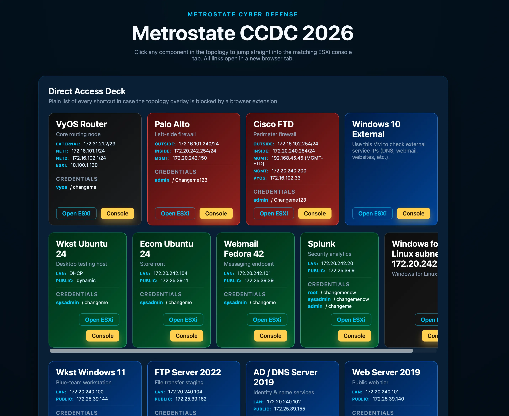

# CCDC Topology ESXi Server

This project provides a simple web dashboard for the Metrostate CCDC 2026 lab. It centralizes topology details and gives one-click access to ESXi VM pages and console sessions.

## Quick Link

- ESXi Server (CCDC topology access): [https://10.100.1.6/ui](https://10.100.1.6/ui)
- Deployed project: [https://esxi.4rji.com/](https://esxi.4rji.com/)

Open `index.html` to use the full topology view and direct-access cards.
